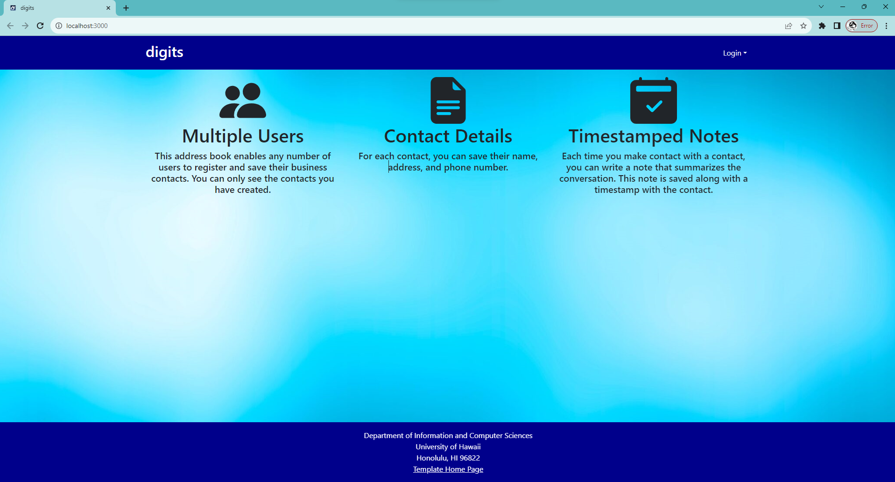
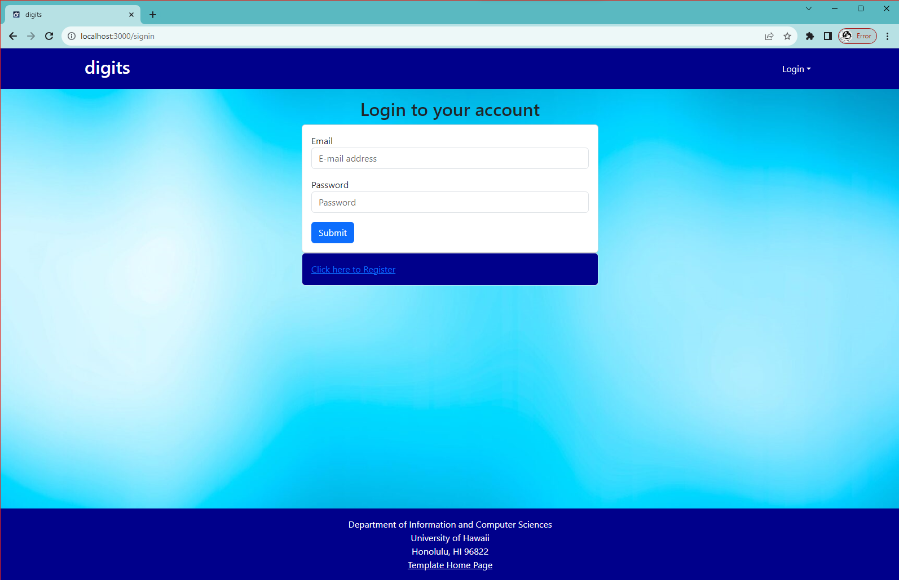
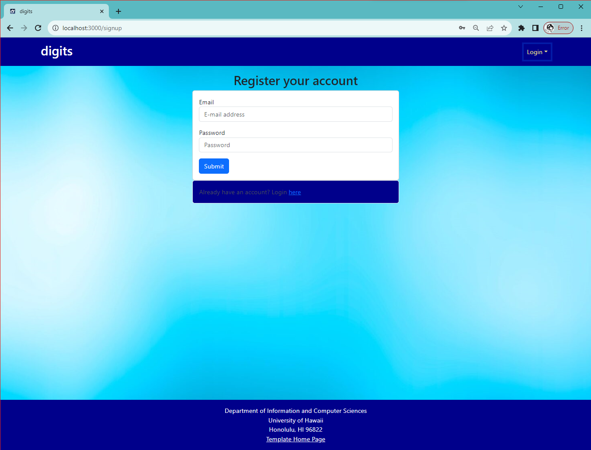
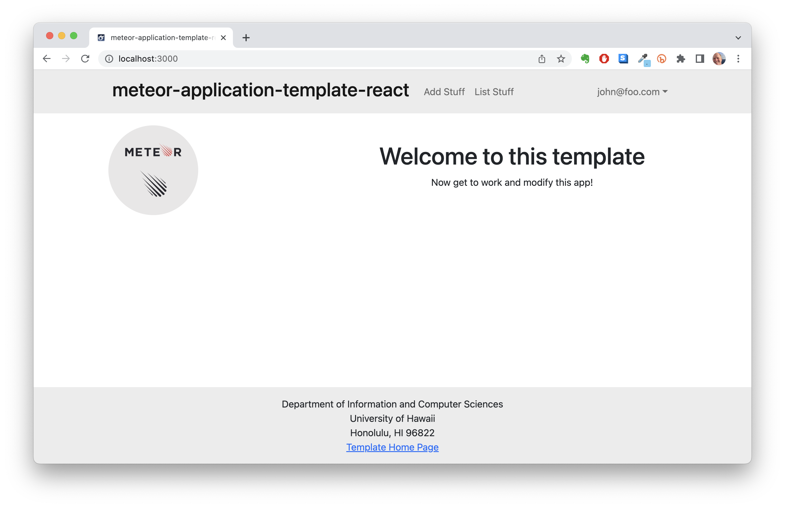
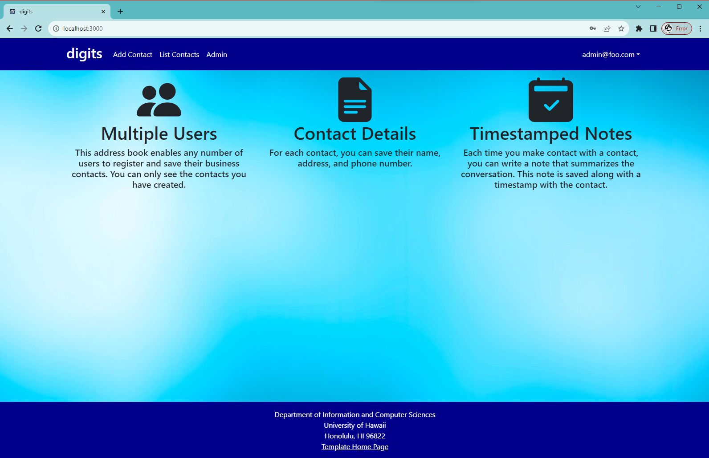
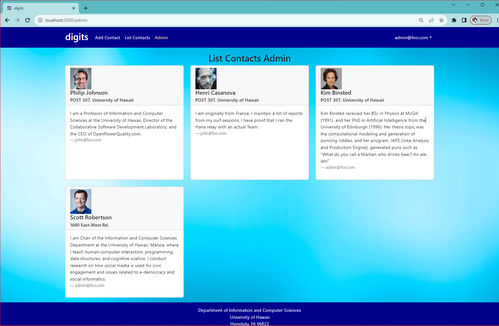
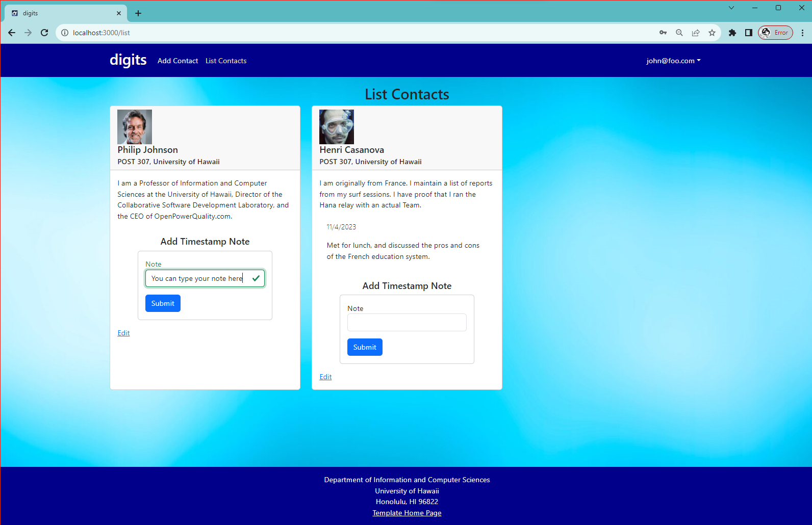
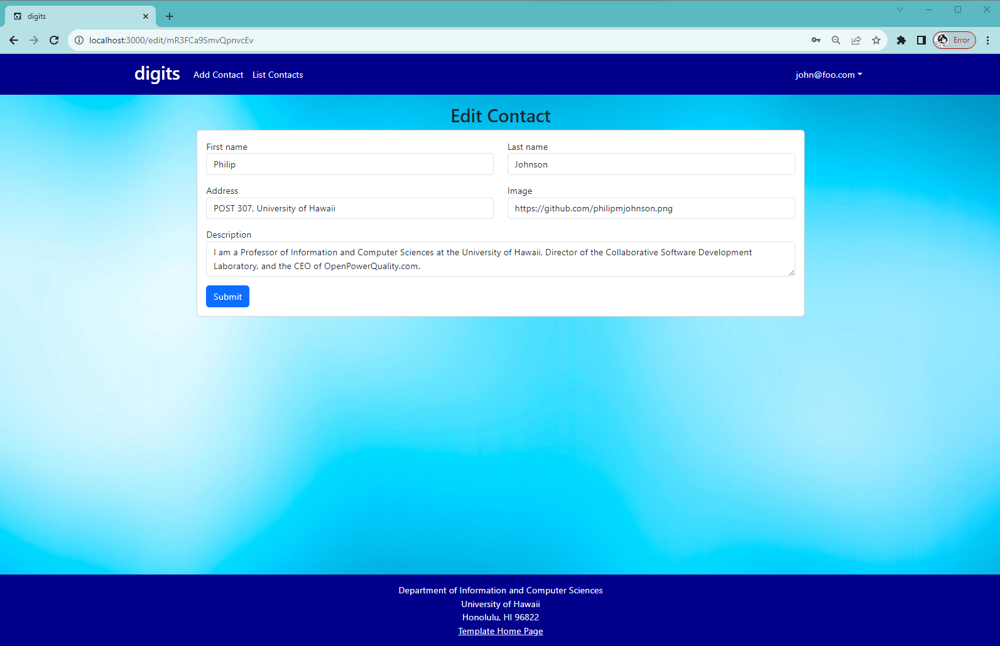
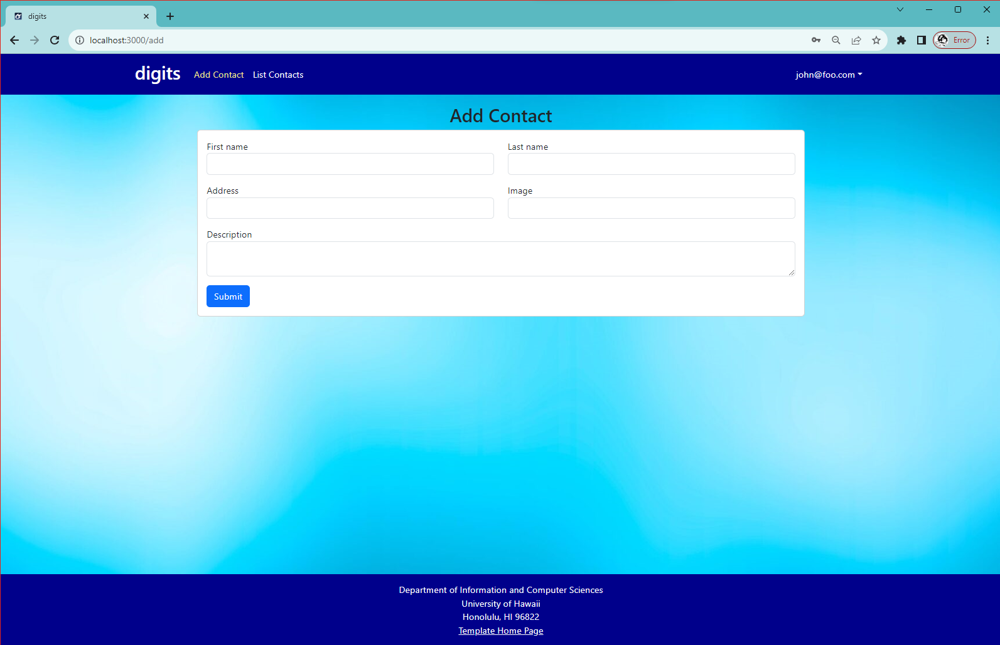

Installation :

In order to use this application you must first install meteor. Then you need to download a copy of the Digits repo. Next you need to open the file with the terminal or something that can use the command prompt. Once you are in the terminal change directory until your are inside of ..\digits\app. Once inside install install all required libraries by typing "meteor npm install". Finally you can run the application with the command "meteor npm install" within the app directory.

Web Pages :

Landing Page :

This is the landing page informing user that this site is used to save, edit, and add contacts. They can also add notes to contacts of the difference interactions they have with their contacts. The user can sign in by clicking the login button that will take them to the login page.

Login Page :

They can either signing with their email and password or create one if they are new by clicking the register button

Register Page :

They can either signing with their email and password or create one if they are new by clicking the register button

Landing (After Login) Page :

After login the landing page will update to look like these and you will have the option to sign-out, to add a contact, or to see your list of contacts. You can sign out by clicking on the username and selecting the sign-out drop down.

Landing (After Admin Login) Page :

If you log in as admin you see the additional nav bar option "Admin" after "List Contacts" THis option will not appear if you are not logged in as the admin.

List Contacts (Admin) Page :

If you click on the "Admin" it will take you to the list contact admin page where you can see all listed contacts in the system. 

List Contacts Page :

In the list contact page each user can see their own listed contacts. Each contact contains the first name, last name, address, and their description. Below the description users can add notes on to the contact about any interactions they had with them. Upon submitting the note there will be a time stamp above the note with the date it was made. Below that on the left in the edit button which allows users to edit the info of that contact.

Edit Contact Page :

In the edit contact page you can only change the first name, last name, address, image, and description of the contact you clicked edit on. Upon submitting the contact will then show the new info.

Add Contact Page :

Clicking on "Add Contact" will take you to the add contact page where you can input the related info and submit it to create a contact that will appear in the contact list.